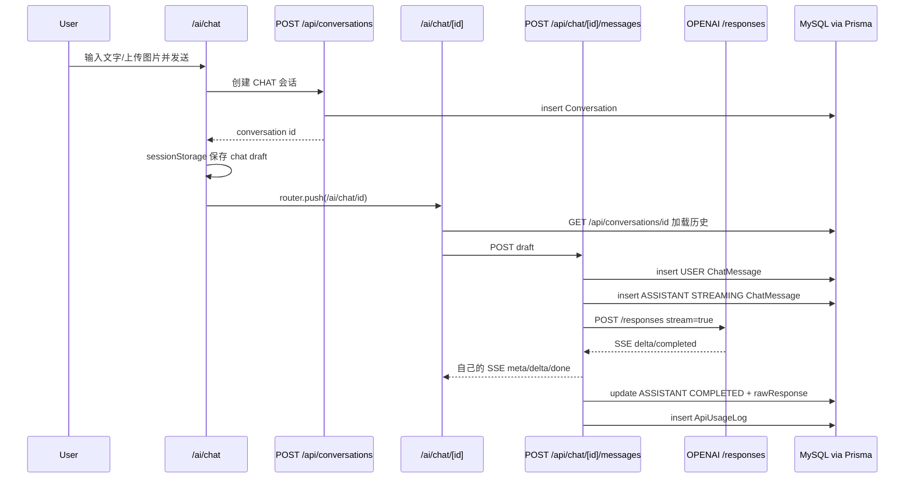
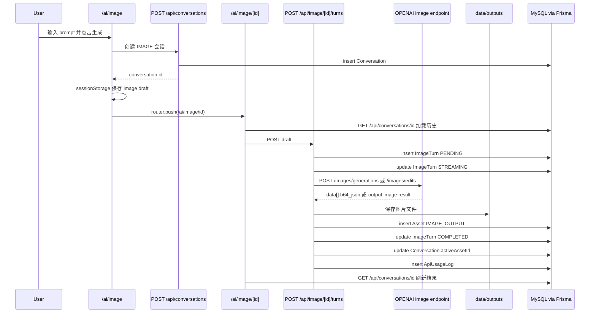

# 项目框架与接口流程导览

这份文档帮助你从“页面交互”一路理解到“Next API、OpenAI 调用、Prisma/MySQL 保存”。项目根目录是 `Main`，当前技术栈是 Next.js App Router + TypeScript + Tailwind + Prisma + MySQL。

## 1. 关键目录先理解

### `src/app`

这是 Next.js App Router 的入口目录。

- `src/app/ai/chat/page.tsx`：新聊天首页 `/ai/chat`。
- `src/app/ai/chat/[id]/page.tsx`：聊天详情页 `/ai/chat/[id]`。
- `src/app/ai/image/page.tsx`：新建图片创作页 `/ai/image`。
- `src/app/ai/image/[id]/page.tsx`：图片创作详情页 `/ai/image/[id]`。
- `src/app/api/**/route.ts`：Next API routes，也就是浏览器请求的后端接口。

简单理解：`src/app` 负责“路由”。页面路由渲染 UI，API 路由处理数据和模型调用。

### `src/components`

这是前端组件层。

- `app-shell`：左侧边栏、最近历史、搜索弹窗。
- `chat`：聊天首页、聊天详情、输入框、消息列表。
- `image-studio`：图片创作工作台。
- `ui`：Button、Dialog、Tabs 等基础 UI 组件。

简单理解：`src/components` 负责“页面长什么样、用户怎么操作”。

### `src/lib`

这是前后端共享的工具和类型层。

- `client-api.ts`：浏览器侧封装的 fetch 方法，例如 `createConversation`、`fetchConversation`、`uploadAsset`。
- `api-types.ts`：前端 DTO 类型，例如 `ConversationItem`、`ChatDraft`、`ImageDraft`。
- `config.ts`：聊天和图片的静态配置，例如模型名、上传数量、图片参数默认值。
- `schemas.ts`：zod 参数校验，所有 API route 进入业务前都会先校验。
- `utils.ts`：标题截断、时间分组等通用工具。

简单理解：`src/lib` 负责“前后端都要用的配置、类型、校验和小工具”。

### `src/server`

这是服务端业务层，只应该在 Next API route 或 Server Component 中使用，不应该直接放到浏览器执行。

- `api.ts`：统一 JSON 成功/失败响应、错误消息、request id 提取。
- `db.ts`：创建 Prisma Client，并提供 `getDefaultUser()`。
- `db-url.ts`：读取数据库连接配置。
- `openai.ts`：对接第三方 OpenAI-compatible API，包括 `/responses`、`/images/generations`、`/images/edits`。
- `serializers.ts`：把 Prisma 查出来的数据库对象转换成前端 DTO。
- `storage.ts`：上传图和输出图的本地文件读写，路径是 `data/uploads` 和 `data/outputs`。

简单理解：`src/server` 是“后端业务工具箱”。API route 自己不要写太多底层细节，而是调用 `src/server` 里的能力。

### `src/generated`

这是 Prisma 根据 `prisma/schema.prisma` 自动生成的数据库客户端代码。

当前 `prisma/schema.prisma` 里写了：

```prisma
generator client {
  provider = "prisma-client"
  output   = "../src/generated/prisma"
}
```

所以执行 `pnpm prisma:generate` 后，Prisma 会把类型和客户端生成到 `src/generated/prisma`。

项目中这些引用都来自这里：

```ts
import { PrismaClient } from "@/generated/prisma/client";
import { ConversationType } from "@/generated/prisma/enums";
```

你可以把 `src/generated` 理解成“Prisma 自动生成的数据库 SDK”。一般不要手动改它，因为下次 generate 会覆盖。

## 2. 数据模型怎么理解

数据库模型在 `prisma/schema.prisma`。

### `User`

预留多用户。第一版没有登录，使用默认用户：

- `getDefaultUser()` 会找 `isDefault=true` 的用户。
- 找不到就创建 `local@ai-chat.dev`。

### `Conversation`

统一保存聊天和图片会话。

关键字段：

- `type`：`CHAT` 或 `IMAGE`。
- `title`：侧边栏展示标题。
- `userId`：归属用户。
- `activeAssetId`：图片会话当前选中的主图。
- `lastMessageAt`：最近历史排序用。
- `deletedAt`：软删除。

### `ChatMessage`

保存聊天消息。

关键字段：

- `conversationId`：属于哪个会话。
- `role`：`USER`、`ASSISTANT`、`SYSTEM`、`DEVELOPER`。
- `content`：文字内容。
- `sequence`：本地消息顺序。
- `status`：`PENDING`、`STREAMING`、`COMPLETED`、`FAILED`。
- `attachments`：用户上传图片的 DTO JSON。
- `providerResponseId`：OpenAI Responses 返回的 response id。
- `previousResponseId`：下一轮串接上下文用。
- `rawResponse`：OpenAI 完整完成响应。
- `errorMessage`：失败原因。

### `ImageTurn`

保存图片创作的每一轮。

关键字段：

- `prompt`：这一轮提示词。
- `params`：图片参数 JSON。
- `referenceAssetIds`：参考图 asset id 列表。
- `outputAssetIds`：输出图 asset id 列表。
- `baseAssetId` / `activeAssetId`：继续修改时的基础图。
- `providerRequest`：发给第三方接口的请求摘要。
- `providerResponse`：第三方返回的原始响应。
- `errorMessage`：失败原因。

### `Asset`

统一保存上传图和输出图的文件记录。

关键字段：

- `kind`：`CHAT_INPUT`、`IMAGE_REFERENCE`、`IMAGE_OUTPUT`、`IMAGE_MASK`。
- `relativePath`：本地文件相对路径。
- `publicPath`：前端可访问路径，当前形如 `/api/assets/{id}`。
- 文件实际落盘：
  - 上传图：`data/uploads/yyyy/mm/dd/{uuid}.ext`
  - 输出图：`data/outputs/yyyy/mm/dd/{uuid}.ext`

### `ApiUsageLog`

保存模型调用日志。

关键字段：

- `kind`：`RESPONSES`、`IMAGE_GENERATION`、`IMAGE_EDIT`。
- `model`：使用的模型。
- `endpoint`：实际调用的第三方 endpoint。
- `statusCode`、`requestId`、`durationMs`。
- `errorMessage`：失败原因。

## 3. 全局布局和侧边栏流程

所有 `/ai/**` 页面都会经过：

```tsx
src/app/ai/layout.tsx
```

它渲染：

```tsx
<AppShell>{children}</AppShell>
```

`AppShell` 负责左侧边栏、最近历史和搜索弹窗。

### 最近历史

前端组件：`src/components/app-shell/app-shell.tsx`

页面加载后调用：

```ts
fetchHistory(null)
```

对应 Next API：

```http
GET /api/conversations?limit=10
```

后端逻辑：

1. `getDefaultUser()` 获取默认用户。
2. 查询 `Conversation`：
   - `userId = 默认用户`
   - `deletedAt = null`
   - 按 `lastMessageAt desc` 排序
   - 每页取 `limit + 1` 判断是否还有下一页
3. include 最新一条 `messages`、最新一条 `imageTurns`、所有 `assets`。
4. 用 `conversationListItem()` 转成前端列表 DTO。

返回格式：

```json
{
  "items": [
    {
      "id": "conversation id",
      "type": "CHAT",
      "title": "标题",
      "preview": "预览文本",
      "activeAssetId": null,
      "activeAssetUrl": null,
      "lastMessageAt": "ISO 时间",
      "createdAt": "ISO 时间",
      "updatedAt": "ISO 时间"
    }
  ],
  "nextCursor": "ISO 时间或 null"
}
```

下滑触底触发分页加载时：

```http
GET /api/conversations?limit=10&cursor={lastMessageAt}
```

后端用 `lastMessageAt < cursor` 做下一页。

### 重命名

前端调用：

```http
PATCH /api/conversations/{id}
Content-Type: application/json

{ "title": "新标题" }
```

后端更新 `Conversation.title`，再返回列表 DTO。

### 删除

前端调用：

```http
DELETE /api/conversations/{id}
```

后端不是物理删除，而是：

```ts
deletedAt = new Date()
```

所以这是软删除。

## 4. 搜索弹窗流程

前端组件：`src/components/app-shell/search-dialog.tsx`

打开弹窗后，输入框每次变化会 debounce 180ms 调用：

```http
GET /api/search?q={关键词}&type={ALL|CHAT|IMAGE}
```

后端逻辑：

1. 获取默认用户。
2. 查询未删除的 `Conversation`。
3. 如果 `type=CHAT` 或 `type=IMAGE`，加类型过滤。
4. 如果有 `q`，在三个地方搜索：
   - `Conversation.title contains q`
   - `ChatMessage.content contains q`
   - `ImageTurn.prompt contains q`
5. 按 `lastMessageAt desc` 返回最多 50 条。

搜索结果点击后：

- `CHAT` 跳 `/ai/chat/{id}`
- `IMAGE` 跳 `/ai/image/{id}`

## 5. `/ai/chat` 新聊天首页流程

页面文件：

```txt
src/app/ai/chat/page.tsx
src/components/chat/chat-home.tsx
src/components/chat/chat-composer.tsx
```

### 页面初始渲染

`/ai/chat/page.tsx` 是 Server Component，会随机挑一句欢迎语传给 `ChatHome`。

### 用户上传聊天图片

在 `ChatComposer` 里点上传图片，浏览器调用：

```http
POST /api/assets/upload
Content-Type: multipart/form-data

file = 图片文件
kind = CHAT_INPUT
conversationId = 可选，新聊天首页没有
```

后端逻辑：

1. zod 校验 `kind`、`conversationId`。
2. 检查文件类型，只允许 PNG、JPG、WebP。
3. 检查大小，聊天图片使用 `chatConfig.maxUploadBytes`。
4. `saveUploadedAsset()` 把文件写入 `data/uploads`。
5. 创建 `Asset` 记录：
   - `kind = CHAT_INPUT`
   - `publicPath = /api/assets/{id}`
   - 新聊天首页上传时 `conversationId` 暂时为空。

返回：

```json
{
  "item": {
    "id": "asset id",
    "kind": "CHAT_INPUT",
    "url": "/api/assets/{id}"
  }
}
```

### 用户发送第一条消息

`ChatHome.submit()` 不直接调 OpenAI，而是先创建本地会话：

```http
POST /api/conversations
Content-Type: application/json

{
  "type": "CHAT",
  "title": "用户输入内容或新聊天"
}
```

后端创建：

- `Conversation.type = CHAT`
- `Conversation.title = compactTitle(title)`
- `Conversation.userId = 默认用户 id`

然后前端做两件事：

1. 把用户输入暂存到 `sessionStorage`：

```ts
chat-draft:{conversationId} = {
  content,
  assetIds,
  reasoningEffort
}
```

2. 跳转：

```ts
router.push(`/ai/chat/${conversationId}`)
```

所以第一条消息真正调用模型是在详情页 `/ai/chat/[id]` 发生的。

## 6. `/ai/chat/[id]` 聊天详情页流程

页面文件：

```txt
src/app/ai/chat/[id]/page.tsx
src/components/chat/chat-detail.tsx
src/app/api/chat/[id]/messages/route.ts
```

### 进入详情页先加载会话

前端调用：

```http
GET /api/conversations/{id}
```

后端查询：

- `Conversation`
- 全量 `messages`，按 `sequence asc`
- 全量 `imageTurns`
- 全量 `assets`

返回 `ConversationDetail`：

```json
{
  "item": {
    "id": "conversation id",
    "type": "CHAT",
    "title": "标题",
    "messages": [],
    "imageTurns": [],
    "assets": []
  }
}
```

如果发现这个会话其实是 `IMAGE`，前端会自动跳到 `/ai/image/{id}`。

### 自动发送首页暂存 draft

详情页加载完成后执行：

```ts
const draft = takeChatDraft(id)
if (draft) await send(draft)
```

这就是为什么首页发送后会先跳详情页，再开始流式回复。

### 用户在详情页发送消息

前端调用：

```http
POST /api/chat/{id}/messages
Content-Type: application/json

{
  "content": "用户文本",
  "assetIds": ["上传图片 asset id"],
  "reasoningEffort": "auto"
}
```

后端处理顺序：

1. zod 校验 `chatMessageSchema`。
2. 确认会话存在、属于默认用户、`type=CHAT`。
3. `attachAssetsToConversation(assetIds, id)` 把之前上传但未绑定的图片绑定到会话。
4. 查询上一条带 `providerResponseId` 的 assistant 消息，作为 `previous_response_id`。
5. 创建用户消息 `ChatMessage`：
   - `role = USER`
   - `content = 用户文本`
   - `attachments = attachedAssets.map(assetToDto)`
   - `status = COMPLETED`
6. 创建 assistant 占位消息：
   - `role = ASSISTANT`
   - `status = STREAMING`
   - `previousResponseId = 上一轮 response id`
7. 如果会话标题还是“新聊天”，用用户输入更新标题。
8. 返回一个 `text/event-stream`，开始边请求 OpenAI 边向浏览器推送。

### Next 后端如何组装 OpenAI `/responses` 参数

代码位置：

```ts
src/app/api/chat/[id]/messages/route.ts
```

核心函数：

```ts
buildResponsesInput(conversationId)
```

它会查询本会话所有 `COMPLETED` 的 `ChatMessage`，按顺序组装成 Responses API 的 `input`。

纯文字用户消息会变成：

```json
{
  "role": "user",
  "content": [
    {
      "type": "input_text",
      "text": "用户文本"
    }
  ]
}
```

带图片的用户消息会额外追加：

```json
{
  "type": "input_image",
  "image_url": "data:image/png;base64,..."
}
```

assistant 历史消息会变成：

```json
{
  "role": "assistant",
  "content": [
    {
      "type": "output_text",
      "text": "上一轮 AI 回复"
    }
  ]
}
```

最终调用第三方 OpenAI-compatible API：

```http
POST {OPENAI_BASE_URL}/responses
Authorization: Bearer {OPENAI_API_KEY}
Content-Type: application/json

{
  "model": "gpt-5.5",
  "input": [
    {
      "role": "user",
      "content": [
        { "type": "input_text", "text": "..." },
        { "type": "input_image", "image_url": "data:image/jpeg;base64,..." }
      ]
    }
  ],
  "stream": true,
  "previous_response_id": "可选，上一轮 response id",
  "reasoning": {
    "effort": "low|medium|high，auto 时不传"
  }
}
```

调用函数在：

```ts
postResponsesStream(payload)
```

实际 endpoint 来自：

```ts
responseEndpoint() = `${OPENAI_BASE_URL}/responses`
```

### OpenAI 流式返回格式和本项目怎么处理

第三方 `/responses` 开启 `stream: true` 后，返回的是 SSE 文本流。每一段大致形态：

```txt
data: {"type":"response.output_text.delta","delta":"你好"}

data: {"type":"response.output_text.done","text":"完整文本"}

data: {"type":"response.completed","response":{"id":"resp_xxx","output":[...]}}
```

本项目服务端解析每个 `data:` JSON：

- `extractDelta(event)`：提取增量文本。
- `extractDoneText(event)`：提取最终完整文本。
- `extractCompletedResponse(event)`：提取完整 response。
- `extractResponseText(response)`：从完整 response 兜底提取文本。

服务端再把模型增量转成自己的 SSE 格式发给浏览器：

```txt
event: meta
data: {"userMessageId":"...","assistantMessageId":"...","attachments":[...]}

event: delta
data: {"text":"你"}

event: delta
data: {"text":"好"}

event: done
data: {"text":"你好"}
```

浏览器 `ChatDetail` 用 `ReadableStream` 读取，调用：

```ts
parseSseChunk(buffer, onEvent)
```

处理方式：

- `meta`：把上传图 attachments 补到临时用户消息上。
- `delta`：把增量文本追加到临时 assistant 消息上，形成逐字输出。
- `error`：把 assistant 临时消息标记为失败。

### 聊天成功后保存什么

模型完成后，后端更新 assistant `ChatMessage`：

- `content = finalText`
- `status = COMPLETED`
- `providerResponseId = response.id`
- `rawResponse = 完整 response JSON`

同时更新：

- `Conversation.lastMessageAt = now`
- 创建 `ApiUsageLog`：
  - `kind = RESPONSES`
  - `model = chatConfig.model`
  - `endpoint = {OPENAI_BASE_URL}/responses`
  - `statusCode`
  - `requestId`
  - `durationMs`

如果失败：

- assistant 消息 `status = FAILED`
- `errorMessage = 错误原因`
- `ApiUsageLog.errorMessage = 错误原因`

## 7. `/ai/image` 新建图片页流程

页面文件：

```txt
src/app/ai/image/page.tsx
src/components/image-studio/image-studio.tsx
```

### 页面初始状态

`/ai/image` 渲染 `ImageStudio`，但没有 `id`。这时它只是一个新建工作台：

- 左侧 prompt 和参考图上传。
- 中间预览区。
- 右侧参数面板。

默认参数来自：

```ts
imageConfig.defaults
```

例如：

```json
{
  "aspectRatio": "auto",
  "model": "gpt-image-2",
  "quality": "high",
  "n": 1,
  "outputFormat": "png",
  "outputCompression": 100,
  "moderation": "auto",
  "size": "auto",
  "background": "auto",
  "stream": false,
  "partialImages": 0
}
```

### 上传参考图

前端调用：

```http
POST /api/assets/upload
Content-Type: multipart/form-data

file = 图片文件
kind = IMAGE_REFERENCE
conversationId = 可选，新建页没有
```

后端保存到 `data/uploads`，创建 `Asset.kind = IMAGE_REFERENCE`。

### 点击生成

如果当前没有 `id`，前端不会直接调用生图接口，而是先创建图片会话：

```http
POST /api/conversations
Content-Type: application/json

{
  "type": "IMAGE",
  "title": "prompt 文本"
}
```

后端创建 `Conversation.type = IMAGE`。

然后前端暂存 draft：

```ts
image-draft:{conversationId} = {
  prompt,
  params,
  referenceAssetIds,
  baseAssetId,
  activeAssetId
}
```

再跳转：

```ts
router.push(`/ai/image/${conversationId}`)
```

所以 `/ai/image` 新建页只负责创建会话和跳转，真正生图发生在 `/ai/image/[id]`。

## 8. `/ai/image/[id]` 图片详情页流程

页面文件：

```txt
src/app/ai/image/[id]/page.tsx
src/components/image-studio/image-studio.tsx
src/app/api/image/[id]/turns/route.ts
```

### 进入详情页先加载会话

前端调用：

```http
GET /api/conversations/{id}
```

如果返回的 `type` 不是 `IMAGE`，前端自动跳 `/ai/chat/{id}`。

如果是图片会话：

- 加载历史 `imageTurns`。
- 加载 `assets`。
- 找最新一轮 prompt 回填输入框。
- 找最新 active image 作为中间画布显示。

### 自动执行新建页暂存 draft

详情页初始化后：

```ts
const draft = takeImageDraft(id)
if (draft) await generate(id, draft)
```

### 调用 Next 生图接口

前端调用：

```http
POST /api/image/{id}/turns
Content-Type: application/json

{
  "prompt": "图片提示词",
  "params": {
    "aspectRatio": "auto",
    "model": "gpt-image-2",
    "quality": "high",
    "n": 1,
    "outputFormat": "png",
    "outputCompression": 100,
    "moderation": "auto",
    "size": "auto",
    "background": "auto",
    "stream": false,
    "partialImages": 0
  },
  "referenceAssetIds": [],
  "baseAssetId": "可选",
  "activeAssetId": "可选",
  "maskAssetId": "可选"
}
```

后端处理顺序：

1. zod 校验 `imageTurnSchema`。
2. 确认会话存在、属于默认用户、`type=IMAGE`。
3. 计算 `referenceAssetIds`。
4. 计算 `editAssetIds`：
   - `baseAssetId`
   - `activeAssetId`
   - `referenceAssetIds`
5. `attachAssetsToConversation()` 把参考图或基础图绑定到会话。
6. 创建 `ImageTurn`：
   - `status = PENDING`
   - `prompt = prompt`
   - `params = params`
   - `referenceAssetIds = referenceAssetIds`
   - `baseAssetId / activeAssetId / maskAssetId`
7. 更新 `Conversation.title` 和 `lastMessageAt`。
8. 把 `ImageTurn.status` 更新为 `STREAMING`。

### 判断调用图片生成还是图片编辑

后端判断：

```ts
const isEdit = editAssetIds.length > 0
```

如果没有参考图、没有基础图：

```ts
postImageGeneration()
```

优先调用：

```http
POST {OPENAI_BASE_URL}/images/generations
Authorization: Bearer {OPENAI_API_KEY}
Content-Type: application/json

{
  "prompt": "...",
  "model": "gpt-image-2",
  "quality": "high",
  "n": 1,
  "size": "auto",
  "output_format": "png",
  "output_compression": 100,
  "moderation": "auto"
}
```

如果第三方返回类似：

```json
{
  "error": {
    "message": "Tool choice 'image_generation' not found in 'tools' parameter."
  }
}
```

项目会自动回退到 Responses 图片工具：

```http
POST {OPENAI_BASE_URL}/responses
Authorization: Bearer {OPENAI_API_KEY}
Content-Type: application/json

{
  "model": "gpt-5.5",
  "input": "图片提示词",
  "tools": [
    {
      "type": "image_generation",
      "size": "auto",
      "quality": "high",
      "output_format": "png"
    }
  ]
}
```

注意：当前已发现你配置的第三方网关对 `gpt-image-2` 生图链路不完整。它可能返回 200，但只返回文本而不是图片数据。项目现在会把这种情况明确报错，并保存 `providerResponse` 方便排查。

如果有参考图或继续修改基础图：

```ts
postImageEdit()
```

调用：

```http
POST {OPENAI_BASE_URL}/images/edits
Authorization: Bearer {OPENAI_API_KEY}
Content-Type: multipart/form-data

prompt = 图片提示词
model = gpt-image-2
quality = high
n = 1
size = auto
output_format = png
image[] = 参考图或基础图文件
mask = 可选，当前 UI 未开放
```

### OpenAI 图片返回格式和本项目怎么处理

传统 images API 预期返回：

```json
{
  "data": [
    {
      "b64_json": "base64 图片内容",
      "revised_prompt": "可选，模型改写后的 prompt"
    }
  ]
}
```

Responses 图片工具可能返回：

```json
{
  "output": [
    {
      "type": "image_generation_call",
      "result": "base64 图片内容"
    }
  ]
}
```

项目统一用：

```ts
extractImageResults(json)
```

提取成：

```ts
[
  {
    base64: "...",
    revisedPrompt: "..."
  }
]
```

### 图片成功后保存什么

每个 base64 结果会调用：

```ts
saveOutputAsset()
```

保存文件到：

```txt
data/outputs/yyyy/mm/dd/{uuid}.png
```

并创建 `Asset`：

- `kind = IMAGE_OUTPUT`
- `conversationId = 当前图片会话 id`
- `publicPath = /api/assets/{assetId}`

然后更新 `ImageTurn`：

- `status = COMPLETED`
- `outputAssetIds = 输出图 asset id 列表`
- `activeAssetId = 第一张输出图 id`
- `providerRequest = endpoint + prompt + params + referenceAssetIds + editAssetIds`
- `providerResponse = 第三方原始返回`

更新 `Conversation`：

- `activeAssetId = 第一张输出图 id`
- `lastMessageAt = now`

创建 `ApiUsageLog`：

- `kind = IMAGE_GENERATION` 或 `IMAGE_EDIT`
- `model = params.model`
- `endpoint = 实际调用 endpoint`
- `statusCode`
- `requestId`
- `durationMs`

返回给前端：

```json
{
  "item": {
    "id": "image turn id",
    "sequence": 1,
    "prompt": "...",
    "status": "COMPLETED",
    "params": {},
    "referenceAssetIds": [],
    "outputAssetIds": ["asset id"],
    "activeAssetId": "asset id",
    "createdAt": "ISO 时间"
  },
  "assets": [
    {
      "id": "asset id",
      "kind": "IMAGE_OUTPUT",
      "url": "/api/assets/{asset id}"
    }
  ]
}
```

前端收到成功后并不直接拼结果，而是重新调用：

```http
GET /api/conversations/{id}
```

用数据库里的最新会话详情刷新 UI。

### 图片失败后保存什么

后端更新 `ImageTurn`：

- `status = FAILED`
- `errorMessage = 错误原因`
- `providerRequest = 本次请求摘要`
- `providerResponse = 如果拿到了第三方响应就保存`

创建 `ApiUsageLog`：

- `errorMessage = 错误原因`
- 其他字段照常记录。

前端显示红色错误条。

## 9. `/api/assets/{id}` 图片读取流程

所有上传图和输出图在前端展示时，URL 都是：

```txt
/api/assets/{assetId}
```

对应接口：

```http
GET /api/assets/{id}
```

后端逻辑：

1. 查 `Asset`。
2. 根据 `relativePath` 找到本地文件。
3. 做路径安全检查，确保不会越过 `data` 目录。
4. 读取文件 buffer。
5. 返回二进制 Response，并设置：
   - `Content-Type = asset.mimeType`
   - `Cache-Control = private, max-age=31536000, immutable`

## 10. 当前主要流程总图

### 聊天首条消息



### 图片首轮生成



## 11. 新手看代码建议顺序

建议按这个顺序读：

1. `prisma/schema.prisma`：先知道数据库有哪些表。
2. `src/lib/api-types.ts`：知道前端拿到的数据长什么样。
3. `src/lib/client-api.ts`：知道浏览器会调用哪些 API。
4. `src/app/api/conversations/route.ts` 和 `src/app/api/conversations/[id]/route.ts`：理解会话基础能力。
5. `src/components/chat/chat-home.tsx` 和 `src/components/chat/chat-detail.tsx`：理解聊天页面跳转和 draft。
6. `src/app/api/chat/[id]/messages/route.ts`：理解聊天模型调用。
7. `src/components/image-studio/image-studio.tsx`：理解图片工作台状态。
8. `src/app/api/image/[id]/turns/route.ts`：理解图片生成/编辑。
9. `src/server/openai.ts`：理解第三方 API 适配。
10. `src/server/storage.ts`：理解图片文件怎么落盘和读取。

## 12. 一句话总结

这个项目的核心设计是：

- `Conversation` 统一承载聊天和图片会话。
- `/ai/chat` 和 `/ai/image` 只负责新建会话并跳详情页。
- 详情页通过 draft 自动发起真正的模型请求。
- 聊天走 `/api/chat/{id}/messages`，再代理到 OpenAI-compatible `/responses`。
- 图片走 `/api/image/{id}/turns`，再代理到 `/images/generations` 或 `/images/edits`。
- Prisma/MySQL 保存会话、消息、图片轮次、文件资产和接口日志。
- 本地文件系统保存上传图和输出图，数据库只保存文件元信息和访问路径。
